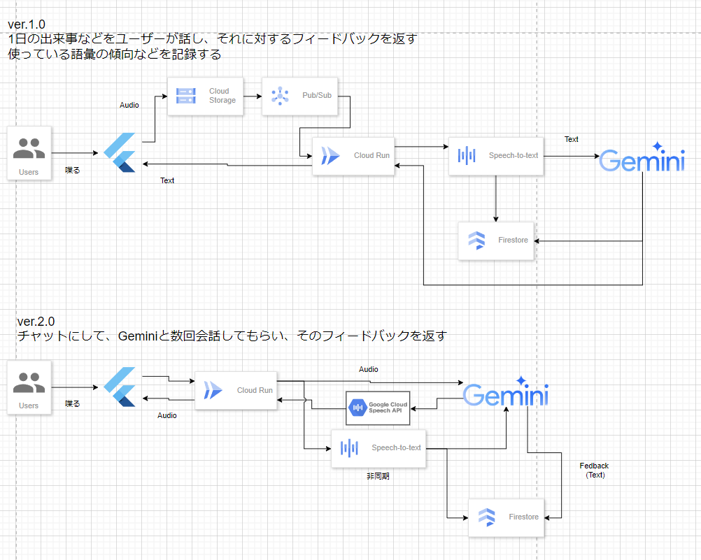

## Introduction

- This is my English learning application to give feedback from audio data
  - Mainly, this app evaluates your speaking ability.
  - Focusing on intermediate level to increase vocablary.

## Architecture

## Tech Stack

- Python
- Dart?
- Flutter?
- Cloud Run
- Speech to Text
- Gemini
- Firebase?

## TODO

- [x] Check SpeechToText
- [x] Check VertexAI Gemini
- [x] Check VertexAI Gemini with system instructions
- [ ] Check LangChain Gemini
- [x] High-level architecture
